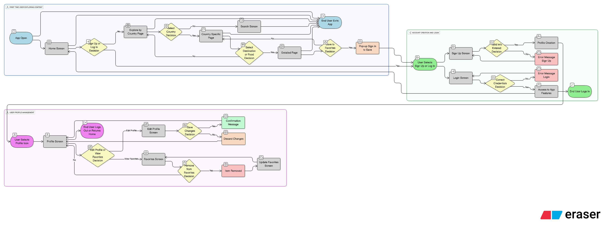

# Travel Guide App — Product Vision

## Vision

The Travel Guide App is designed to make exploring the world easy, fun, and personal. It helps people discover new destinations and traditional foods from different countries, while also allowing them to save their favorite spots for later. Whether you’re planning a trip, learning about another culture, or just curious, the app brings together travel inspiration and cultural experiences in one place.

## What It Offers

-   **Simple Sign Up & Profile**
    Users can quickly create an account and keep a personal profile with their name, photo, and email.

-   **Explore by Country**
    Each country has a page with its top destinations and traditional foods. Users can browse categories like beaches, historical sites, nightlife, and local dishes.

-   **Search Anything**
    A global search makes it easy to find destinations and foods across countries. Users can apply filters (like rating or category) and see recent searches.

-   **Detailed Pages**
    Destinations show photos, best times to visit, maps, travel videos, and reviews. Foods show their history, ingredients, and photos, along with recommended restaurants. Both pages allow saving items as favorites.

-   **Favorites Collection**
    A dedicated section lets users keep a personal list of their favorite destinations and foods, organized into two tabs.

-   **Profile Management**
    Users can edit their details, manage saved items, and sign out whenever they want.

## Why It Matters

Travel isn’t just about visiting new places — it’s about culture, food, and experiences. This app creates a space where people can discover, learn, and plan with ease. It makes travel inspiration interactive, personal, and enjoyable, while building excitement for future journeys.

## Long-Term Goals

-   Expand to include user-uploaded photos and reviews
-   Add restaurant and hotel recommendations powered by real data
-   Enable sharing favorites with friends and family
-   Support offline access for travelers on the go

---
